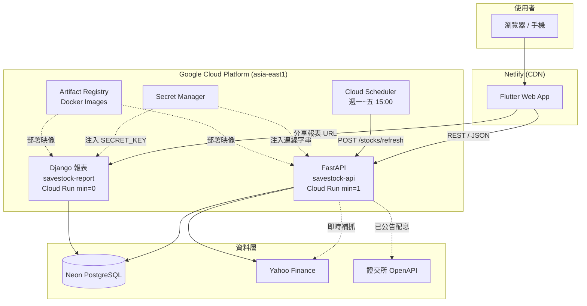

# Savestock — 長線存股防護系統

> **個人全端專案 ‧ 作品集說明書**
> 一套協助存股族避開「高殖利率陷阱」的台股追蹤與股利試算系統。
> 從資料爬取、後端 API、跨平台前端到雲端部署，皆由本人獨立設計與實作。

🔗 **線上 Demo**：https://savestock.netlify.app
📦 **原始碼**：https://github.com/hank92312/Savestock
🗓️ **開發期間**：2026-04 ~ 2026-06（約 1.5 個月，88+ commits）

---

## 1. 專案動機

市面上的存股 App 多半只顯示「當前殖利率」，但這個數字有兩個盲點：

1. **高殖利率陷阱**：股價暴跌會讓殖利率「假性升高」，新手容易誤判為好買點。
2. **股利估算過於樂觀**：季配股年中「已配金額」不等於全年，直接外推會嚴重失真。

Savestock 針對這兩點設計：用**多年平均股利**算真實殖利率、用**產業分級閾值 + 爆量偵測**主動警示異常下跌，並提供**今年度可領股利試算**（區分證交所「已公告」實際值與歷史估算值）。

---

## 2. 技術棧總覽

| 分層 | 技術 | 選用理由 |
|---|---|---|
| **前端** | Flutter (Dart) Web | 一套程式碼跨 Web/iOS/Android；`fl_chart` 畫財經折線圖 |
| **後端 API** | Python + FastAPI | 非同步、自帶 OpenAPI 文件、型別驗證（Pydantic） |
| **報表服務** | Python + Django | 伺服器渲染可分享/可列印 HTML 報表 + 內建 Admin 後台 |
| **資料處理 ETL** | Python（yfinance + SQLAlchemy） | 盤後批次抓價、算股利/殖利率/警示 |
| **資料庫** | PostgreSQL（生產 Neon）/ SQLite（開發） | 經 SQLAlchemy 抽象，靠 `DATABASE_URL` 無痛切換 |
| **雲端運算** | GCP Cloud Run（容器化、Serverless） | 按用量計費、自動擴縮、無需管理伺服器 |
| **CI/建置** | GCP Cloud Build + Artifact Registry | 遠端建置 Docker image（本機免裝 Docker） |
| **排程** | GCP Cloud Scheduler | 每日盤後自動觸發 ETL |
| **機密管理** | GCP Secret Manager | DB 連線字串、Django SECRET_KEY 不落地於程式碼 |
| **前端托管** | Netlify | 靜態檔 CDN 分發、自動 HTTPS |
| **資料來源** | Yahoo Finance（yfinance）、證交所 OpenAPI | 股價/歷史股利 + 官方已公告配息 |

---

## 3. 系統架構



### 資料流

```
Yahoo 財經 ──(yfinance)──► ETL 批次運算 ──► PostgreSQL
證交所 OpenAPI ──(已公告配息)──┘                  │
                                          FastAPI 讀取 / 即時補抓
                                                  │
                              ┌───────────────────┴───────────────────┐
                       Flutter App（互動查詢）          Django 報表（可分享連結）
```

---

## 4. 核心模組

### 4.1 ETL 資料管線（`etl/fetch_data.py`）
- 固定追蹤 **25 檔預設股**，每檔抓 1 年歷史收盤價（約 245 筆/檔）。
- 計算並寫入 `Stock_Master`：平均股利、上市月數、產業別暴跌閾值。
- **由 Cloud Scheduler 每週一至五 15:00（台股收盤後）自動觸發**，無人值守更新。

### 4.2 後端 API（`backend/`，FastAPI）
- 12 支 REST 端點：預設清單、模糊搜尋、個股查詢、歷史價格/股利、自選股 CRUD、投資組合試算。
- **連線池調校**：`pool_pre_ping=True, pool_recycle=300` 解決 Neon 閒置斷線問題。
- **並行抓取**：自選股刷新用 `ThreadPoolExecutor`（max 5 threads），10 檔從 ~250 秒降至 ~50 秒，修掉 504 timeout。

### 4.3 共用計算層（`backend/core/`）— 關鍵設計
> **一份計算邏輯，FastAPI 與 Django 同時 import，杜絕邏輯分歧。**

- `dividend_calc.py`：純函式股利估算引擎（不依賴框架/DB），附 7 個單元測試。
- `twse_dividends.py`：串接證交所 OpenAPI `t187ap45_L`，抓全市場已公告配息、快取 12h、失敗自動回退估算。

### 4.4 Django 報表服務（`web_django/`）
- 伺服器渲染**可列印/可分享**的年度股利報表，網址自帶資料：`/report?d=<base64持股>`。
- **零後端儲存**：持股編碼進 URL，分享不需資料庫寫入、不需 schema 變更。
- 內建 Django Admin 唯讀檢視 `Stock_Master`。

### 4.5 前端（`frontend/lib/`，Flutter）
- 7 大畫面：預設清單、我的股票、搜尋、個股詳情、年度股利試算、教學導覽。
- **效能**：「我的股票」開啟讀 DB 快取（<1 秒），按 🔄 才即時爬 yfinance。
- **分享功能**：試算結果可一鍵分享至 LINE/Facebook、複製連結、或截圖成 PNG（`RepaintBoundary.toImage`）下載分享至社群。

---

## 5. 我解決的關鍵技術問題

| 問題 | 解法 | 成效 |
|---|---|---|
| **高殖利率陷阱** | 用近 2 年平均股利算殖利率，並依產業分級閾值（2.5%~6%）+ 2.5× 爆量偵測異常 | 避免新手誤判假性高殖利率 |
| **季配股股利估算失真** | 不用「今年已配」外推；改用滾動近 1 年；年配股優先採證交所已公告實際值 | 台積電曾被估成實際的 30%，修正後貼近真實 |
| **計算邏輯雙頭維護** | 抽出框架無關的 `core/` 純函式層，FastAPI 與 Django 共用 | 單一事實來源，新增測試只寫一次 |
| **頁面載入慢 / 504 timeout** | DB 快取優先 + 多執行緒並行抓取 | 載入 <1 秒、刷新由 250s → 50s |
| **Neon 免費方案閒置斷線** | SQLAlchemy 連線池 `pre_ping` + `recycle` | 消除 `SSL connection closed` 錯誤 |
| **Flutter Web 開新分頁失效** | `url_launcher` 在新版 web 套件靜默失敗，改用 `package:web` 直接 `window.open` | 分享/報表按鈕恢復正常 |
| **雲端成本** | Cloud SQL → Neon 免費方案；報表服務 `min=0` 冷啟動省錢；前端先本地驗收再部署省 Netlify credits | DB 月費歸零 |

---

## 6. 雲端部署與 DevOps

- **容器化**：FastAPI 與 Django 各自 `Dockerfile`，透過 **Cloud Build 遠端建置**（本機無需安裝 Docker），推送至 **Artifact Registry**。
- **Django 特殊建置**：build context 設為 repo root（`cloudbuild.yaml`），讓報表服務能納入共用的 `backend/core/`。
- **Serverless 運算**：兩服務皆跑在 **Cloud Run**——API `min=1` 防冷啟動、報表 `min=0` 省成本，依流量自動擴縮。
- **機密管理**：`DATABASE_URL`、`SECRET_KEY` 經 **Secret Manager** 注入，不寫進映像或環境變數明文。
- **資料庫 migration**：Django 自有表（auth/admin）以 Cloud Run **Job** 跑 `migrate`，附加於 Neon 而不影響既有 ETL 表。
- **CORS 策略**：生產僅允許 Netlify 網域，另以 regex 開放 `localhost` 供本地開發。

```
本機 git push ──► GitHub
                    │
flutter build ──► Netlify CDN（前端）
                    │
gcloud builds ──► Artifact Registry ──► Cloud Run（API / 報表）
                    │
Secret Manager ─────┘（執行期注入機密）
```

---

## 7. 專案亮點

1. **真正的全端 + DevOps 一條龍**：從爬蟲、API、跨平台前端到雲端部署、排程、機密管理，皆獨立完成。
2. **架構決策有取捨**：共用 `core/` 層、Serverless `min` 值調校、URL 自帶資料的無狀態報表，都是為了**可維護性與成本**做的明確權衡。
3. **解決真實的領域問題**：股利口徑（現金＋配股面額還原）、季配股估算失真、官方已公告 vs 歷史估算——這些是金融資料的真實坑，不是 CRUD 練習。
4. **重視成本意識**：主動把 DB 月費降到零、用冷啟動策略與部署節流控管雲端開銷。
5. **測試與文件**：核心計算附單元測試（驗證「為何重要」而非僅「做了什麼」）；維護 `APP.md` 架構文件與交接報告。

---

## 8. 已知限制與未來規劃

- **上櫃（.TWO）年配股**：證交所 `t187ap45_L` 僅含上市，上櫃暫走估算。
- **資料來源合規**：yfinance 爬 Yahoo 為非官方途徑，正式商用前須評估合法資料源。
- **帳號系統**：目前為訪客 UUID（綁裝置），未來規劃 OAuth 登入與雲端同步。
- **通知系統**：`User_Preferences` 已備欄位，待接 FCM 推播 / Email。

---

## 9. 專案結構

```
Savestock/
├── frontend/          # Flutter 跨平台前端
│   └── lib/
│       ├── screens/   # 7 大畫面
│       ├── services/  # API 呼叫、本地儲存、跨畫面通知
│       ├── models/    # 資料模型
│       └── widgets/   # 共用元件
├── backend/           # FastAPI 後端
│   ├── core/          # ★ 框架無關共用計算層（FastAPI/Django 共用）
│   ├── routers/       # API 路由
│   ├── tests/         # pytest 單元測試
│   └── Dockerfile
├── web_django/        # Django 報表服務 + Admin
│   ├── report/        # 報表 app（views/models/templates）
│   └── Dockerfile
├── etl/               # 盤後資料管線
├── database/          # SQLite / PostgreSQL schema
└── cloudbuild.yaml    # Django 容器建置設定
```

---

> 本文件為作品集說明用途。完整架構細節見 [APP.md](APP.md)。
