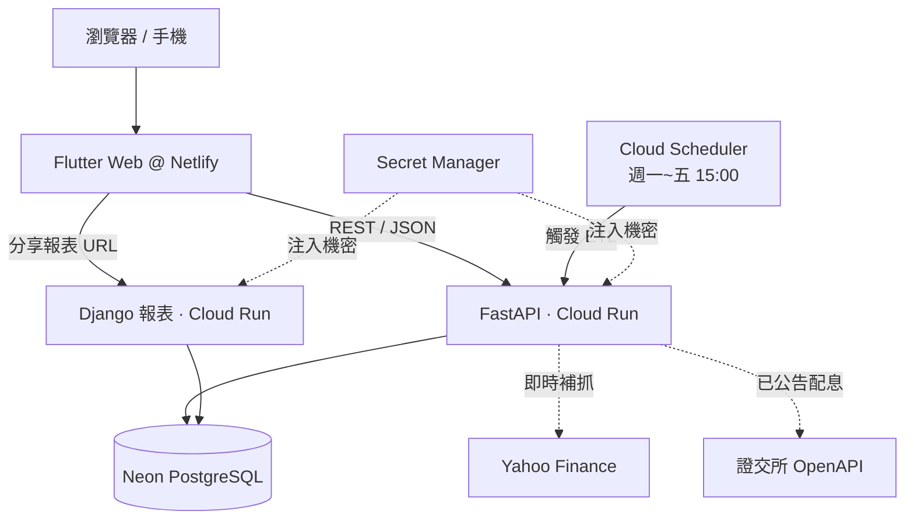

<h1 align="center">📈 Savestock — 長線存股防護系統</h1>

<p align="center">
  協助存股族避開「高殖利率陷阱」的台股追蹤與年度股利試算系統<br/>
  <em>個人全端專案 ‧ 從資料爬取、API、跨平台前端到雲端部署皆獨立完成</em>
</p>

<p align="center">
  <a href="https://savestock.netlify.app"><b>🔗 線上 Demo</b></a> ‧
  <a href="PORTFOLIO.md"><b>📖 作品集說明書</b></a> ‧
  <a href="APP.md"><b>🏗️ 架構文件</b></a>
</p>

<p align="center">
  
  
  
  
  
  
</p>

---

## 💡 這個專案在解決什麼問題？

市面上的存股 App 多半只顯示「當前殖利率」，但這個數字有兩個盲點：

- **高殖利率陷阱**：股價暴跌會讓殖利率「假性升高」，新手容易誤判為買點。
- **股利估算過於樂觀**：季配股年中「已配金額」不等於全年，直接外推會嚴重失真。

Savestock 用**多年平均股利**算真實殖利率、用**產業分級閾值 + 爆量偵測**主動警示異常下跌，並提供**年度股利試算**（區分證交所「已公告」實際值與歷史估算值）。

---

## ✨ 主要功能

- 📊 **25 檔預設存股清單** — 依近一年殖利率排序，盤後自動更新
- 🔍 **全台股搜尋與追蹤** — 模糊搜尋代號/中文名，自選股管理
- 🚨 **異常警示** — 產業分級暴跌閾值（2.5%~6%）+ 2.5× 爆量偵測
- 🧮 **年度股利試算** — 輸入持股估算今年可領股利，區分已公告 vs 估算
- 🔗 **可分享報表** — 一鍵分享至 LINE/Facebook、複製連結、截圖成 PNG
- 📈 **互動圖表** — 收盤價與股利歷史折線圖

---

## 🏗️ 技術架構



| 分層 | 技術 |
|---|---|
| 前端 | **Flutter (Dart) Web** — 一套程式碼跨平台、`fl_chart` 財經圖表 |
| 後端 API | **Python FastAPI** — 非同步、Pydantic 型別驗證、自帶 OpenAPI |
| 報表服務 | **Django** — 伺服器渲染可分享/可列印報表 + Admin |
| ETL | **Python (yfinance + SQLAlchemy)** — 盤後批次運算 |
| 資料庫 | **PostgreSQL (Neon)** / SQLite — `DATABASE_URL` 無痛切換 |
| 雲端 | **GCP Cloud Run / Build / Scheduler / Secret Manager** |
| 托管 | **Netlify**（前端 CDN） |

> 完整技術選型理由與架構決策見 **[作品集說明書 PORTFOLIO.md](PORTFOLIO.md)**。

---

## 🔑 技術亮點

- **共用計算層**：抽出框架無關的 `backend/core/` 純函式層，FastAPI 與 Django **共用同一份股利計算邏輯**，杜絕雙頭維護。
- **效能調校**：DB 快取優先 + `ThreadPoolExecutor` 並行抓取，自選股刷新從 250 秒降至 ~50 秒。
- **無狀態分享報表**：持股資料 base64 編碼進 URL（`/report?d=...`），分享不需資料庫寫入。
- **成本意識**：Cloud SQL → Neon 免費方案（DB 月費歸零）、Cloud Run `min=0` 冷啟動省錢。
- **Serverless DevOps**：Cloud Build 遠端建置（本機免裝 Docker）、Secret Manager 注入機密、Cloud Scheduler 無人值守排程。

---

## 📁 專案結構

```
Savestock/
├── frontend/      # Flutter 跨平台前端（screens / services / models / widgets）
├── backend/       # FastAPI 後端
│   └── core/      # ★ 框架無關共用計算層（FastAPI/Django 共用）
├── web_django/    # Django 報表服務 + Admin
├── etl/           # 盤後資料管線
├── database/      # SQLite / PostgreSQL schema
└── cloudbuild.yaml
```

---

## 🚀 本地開發

```powershell
# 後端 API
cd backend; uvicorn main:app --port 8000

# 前端（CORS 已允許 localhost）
cd frontend; flutter run -d chrome

# 後端測試
python -m pytest backend/tests/ -q
```

---

## 📚 延伸文件

- **[PORTFOLIO.md](PORTFOLIO.md)** — 完整作品集說明書（技術選型理由、架構決策、解決的問題）
- **[APP.md](APP.md)** — 詳細架構與 API 文件
- **[HANDOVER.md](HANDOVER.md)** — 開發交接報告

---

<p align="center"><sub>本專案為個人作品集用途。</sub></p>
